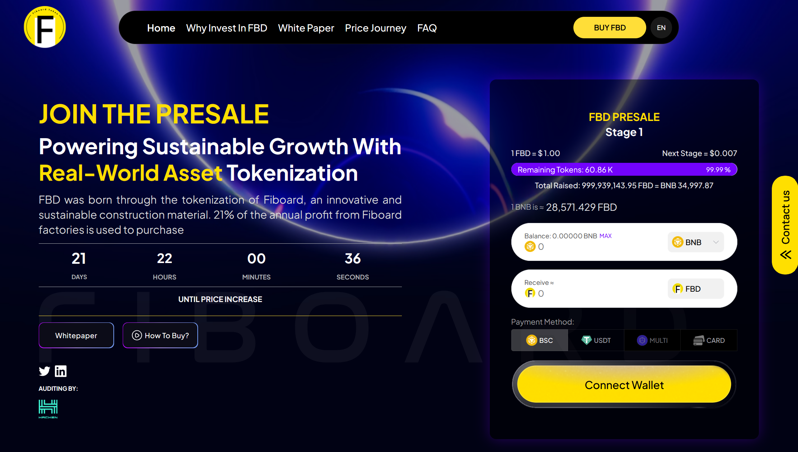

# Fiboard Token



##  JOIN THE PRESALE
Powering sustainable growth with Real-world Asset tokenization
FBD was born through the tokenization of Fiboard, an innovative and sustainable construction material. 21% of the annual profit from Fiboard factories is used to purchase.
[Fiboard PRESALE](https://fiboard.org/)

## Video Fiboard
[](https://www.youtube.com/watch?v=Ay0KmGiA0cY)

# Bitcoin MENA Event
[](https://youtu.be/gJFLXhtjEn8?si=Dlh6lyEBCifTzZCL)

## Details This Project
Fiboard is a token built on the Binance Smart Chain (BNB), developed using Solidity and managed with Hardhat for smart contract deployment and testing.

Smart Contract Address (BSC): `0x279369F9AC1200CeD897E69C4Fe90528E05dF4DB`
[Link BSC](https://bscscan.com/address/0x279369F9AC1200CeD897E69C4Fe90528E05dF4DB)


## Features

- **Blockchain:** Binance Smart Chain (BSC)
- **Programming Language:** Solidity
- **Development Framework:** Hardhat

## Prerequisites

Before getting started, make sure you have the following installed:

- [Node.js](https://nodejs.org/) (version 12 or later)
- [npm](https://www.npmjs.com/) or [Yarn](https://yarnpkg.com/)

## Installation

Clone the repository and install dependencies:

```bash
git clone https://github.com/FBDtoken/FBDtoken.git
cd FBDtoken
npm install
```

## Configuration
```
Add mnemonic to ignition/modules Token.js

```

**Note:** Your private key is used to sign transactions; do not share it with anyone.

## Compilation

To compile the smart contracts, run:

```bash
npx hardhat compile
```

## Deployment

To deploy the contract on the testnet or mainnet BSC, run:

```bash
npx hardhat run scripts/deploy.js --network mainnet
npx hardhat run scripts/deploy.js --network testnet
```

Networks are configured in the `hardhat.config.js` file.

## Testing

To run tests, execute:

```bash
npx hardhat test
```

## Resources

- [Official Fiboard Website](https://fiboard.org/)
- [X Account Fiboard](https://x.com/FBDtoken)
- [Youtube Fiboard](https://www.youtube.com/@FBDToken)
- [Linkdin Account Fiboard](https://www.linkedin.com/company/fbd-foundation/)
- [Bitcoin MENA Event](https://youtu.be/gJFLXhtjEn8?si=Dlh6lyEBCifTzZCL)
- [Hardhat Documentation](https://hardhat.org/getting-started/)

## License
Fiboard
